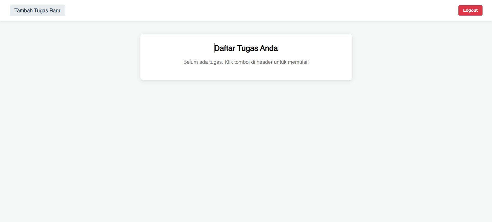

# 🚀 Aplikasi Web To-Do List

Aplikasi web sederhana untuk mengelola daftar tugas pribadi. Dilengkapi dengan sistem autentikasi pengguna sehingga setiap daftar tugas bersifat privat dan hanya bisa diakses oleh pemiliknya.

## ✨ Fitur Utama

* **Autentikasi Pengguna:** Sistem pendaftaran (register) dan masuk (login) yang aman menggunakan JWT.
* **Manajemen Tugas (CRUD):** Tambah, lihat, dan hapus tugas dengan mudah.
* **Real-Time Update:** Perubahan pada daftar tugas (tambah/hapus) akan langsung terlihat di semua perangkat yang terbuka tanpa perlu me-refresh halaman, berkat WebSocket.
* **Tugas Privat:** Setiap pengguna hanya dapat melihat dan mengelola daftar tugas miliknya sendiri.
* **UI Interaktif:** Antarmuka yang bersih dengan modal untuk menambah dan mengonfirmasi penghapusan tugas, serta efek hover pada tombol untuk pengalaman pengguna yang lebih baik.

## 💻 Pratinjau Aplikasi



## 🛠️ Teknologi yang Digunakan

Berikut adalah daftar teknologi utama yang digunakan dalam proyek ini:

* **Frontend:**
    * Vue.js 3 (Composition API)
    * Vite
    * Axios (HTTP Client)
    * Mitt (Event Bus)
* **Backend:**
    * Node.js
    * Express.js
    * WebSocket (ws)
* **Database:**
    * MySQL
* **Lainnya:**
    * JWT (Otentikasi)
    * Bcrypt (Password Hashing)

## ⚙️ Instalasi & Menjalankan Proyek

Ikuti langkah-langkah berikut untuk menjalankan proyek ini di lingkungan lokal Anda:

1.  **Clone repository ini:**
    ```bash
    git clone https://github.com/fandipres/to-do-list.git
    cd to-do-list
    ```

2.  **Instalasi dependensi (Backend):**
    ```bash
    cd backend
    npm install
    ```

3.  **Instalasi dependensi (Frontend):**
    ```bash
    cd frontend
    npm install
    ```

4.  **Konfigurasi Database:**
    * Pastikan Anda memiliki server MySQL yang sedang berjalan.
    * Buat sebuah database baru dengan nama `todo`.
    * Jalankan query SQL dari file `db/todo.sql` untuk membuat tabel `users` dan `todo`.
    * Sesuaikan konfigurasi koneksi database di dalam file `backend/db.js` jika diperlukan.

5.  **Jalankan aplikasi:**
    * Untuk Backend: `npm run start` (di dalam folder `backend`)
    * Untuk Frontend: `npm run dev` (di dalam folder `frontend`)

6.  Buka browser Anda dan akses `http://localhost:8080` (atau port lain yang ditampilkan oleh Vite).

## 🔗 Tautan

* **Live Demo:** [Belum di-deploy]
* **Repository:** [github.com/fandipres/to-do-list](https://github.com/fandipres/to-do-list)

## 📄 Lisensi

Proyek ini dilisensikan di bawah [Lisensi MIT](https://www.google.com/search?q=LICENSE).