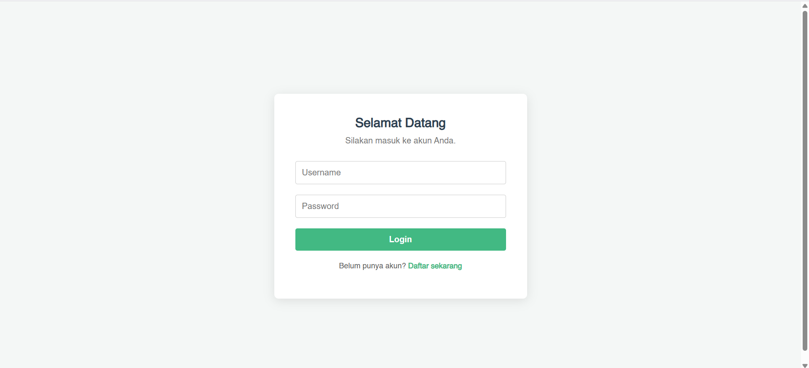
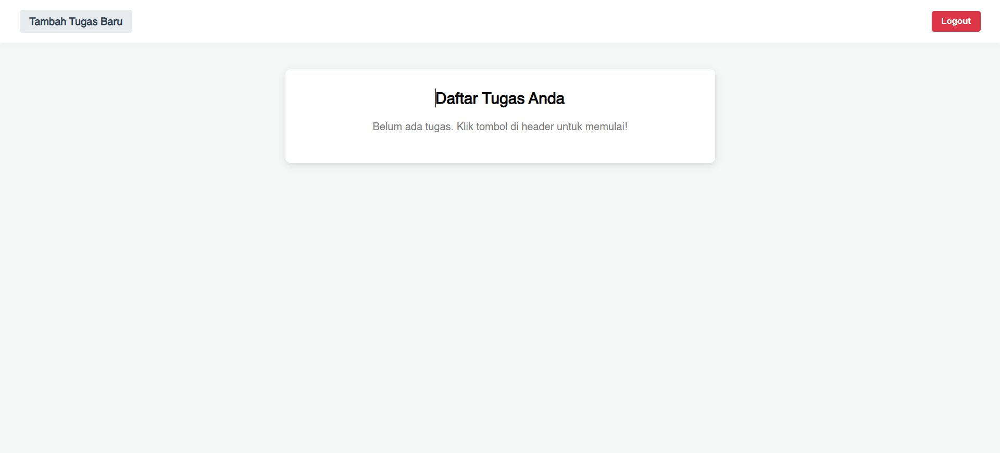

# 🚀 To-Do List (Web App)

A simple web application for managing personal to-do lists. It features a user authentication system, ensuring that each to-do list is private and accessible only by its owner.

## ✨ Key Features

* **User Authentication:** Secure registration and login system using JWT.
* **Task Management (CRUD):** Easily add, view, and delete tasks.
* **Real-Time Updates:** Changes to the to-do list (add/delete) are instantly reflected across all open devices without needing a page refresh, thanks to WebSockets.
* **Private Tasks:** Each user can only view and manage their own to-do list.
* **Interactive UI:** A clean interface with modals for adding tasks and confirming deletions, plus hover effects on buttons for an enhanced user experience.

## 💻 Application Preview


*Login page.*

*Home page.*

## 🛠️ Tech Stack

The main technologies used in this project include:

* **Frontend:**
    * Vue.js 3 (Composition API)
    * Vite
    * Axios (HTTP Client)
    * Mitt (Event Bus)
* **Backend:**
    * Node.js
    * Express.js
    * WebSocket (ws)
* **Database:**
    * MySQL
* **Others:**
    * JWT (Authentication)
    * Bcrypt (Password Hashing)

## ⚙️ Installation & Setup

Follow these steps to get the project running on your local machine:

1.  **Clone this repository:**
    ```
    git clone https://github.com/fandipres/to-do-list.git
    cd to-do-list
    ```

2.  **Install backend dependencies:**
    ```
    cd backend
    npm install
    ```

3.  **Install frontend dependencies:**
    ```
    cd frontend
    npm install
    ```

4.  **Database Configuration:**
    * Ensure you have a running MySQL server.
    * Create a new database named `todo`.
    * Run the SQL query from the `db/todo.sql` file to create the `users` and `todo` tables.
    * Adjust the database connection settings in the `backend/db.js` file if necessary.

5.  **Run the application:**
    * For the Backend: `npm run start` (in the `backend` folder)
    * For the Frontend: `npm run dev` (in the `frontend` folder)

6.  Open your browser and navigate to `http://localhost:8080` (or the port specified by Vite).

## 🔗 Links

* **Live Demo:** [Not deployed yet]
* **Repository:** [github.com/fandipres/to-do-list](https://github.com/fandipres/to-do-list)

## 📄 License

This project is licensed under the [MIT License](https://opensource.org/licenses/MIT).